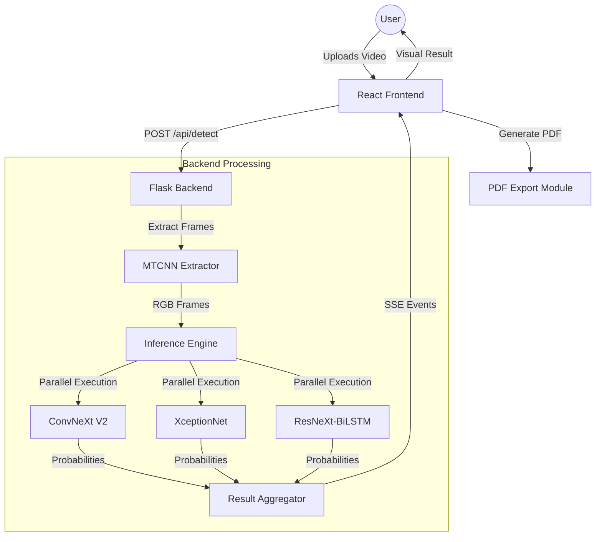
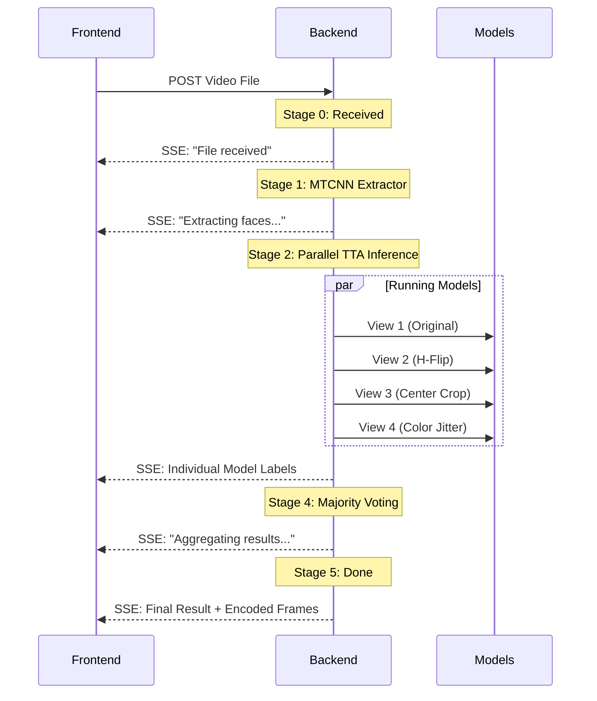

# DeepGuard: Deepfake Detection Project Report

## 1. Project Overview

DeepGuard is a state-of-the-art deepfake detection application designed to provide reliable, multi-model analysis of video content. By combining multiple deep learning architectures and spatio-temporal analysis, DeepGuard offers a robust defense against increasingly sophisticated synthetic media.

### Key Features
- **Triple-Model Ensemble**: Utilizes ConvNeXt V2, XceptionNet, and ResNeXt50-BiLSTM for diverse feature extraction.
- **TTA (Test-Time Augmentation)**: Enhances accuracy by analyzing multiple views of each frame.
- **Real-time Progress**: Uses Server-Sent Events (SSE) to stream processing status back to the user.
- **Interactive Reports**: Generates detailed PDF reports including model confidence scores and extracted frames.

---

## 2. System Architecture

The project follows a modern client-server architecture with a clear separation between the AI processing engine and the user interface.

---

## 3. Backend Deep Dive

### 3.1 Neural Network Architectures
DeepGuard employs an ensemble of three distinct models to capture different types of artifacts in deepfake videos:

1.  **ConvNeXt V2 (Base)**: A modern vision model that improves upon traditional CNNs with transformer-inspired architectural choices (LayerNorm, GELU, global average pooling). It is highly effective at capturing global and local texture inconsistencies.
2.  **XceptionNet**: Focuses on depthwise separable convolutions, which are particularly good at detecting the "ghosting" and blur artifacts common in face-swapping algorithms.
3.  **ResNeXt50-BiLSTM**: This model adds a temporal dimension. It extracts spatial features via ResNeXt and processes them as a sequence through a Bidirectional LSTM, allowing it to detect unnatural movements or flickering between frames.

### 3.2 Inference Pipeline
The inference process is designed for both accuracy and user feedback:

### 3.3 Test-Time Augmentation (TTA)
To minimize false negatives, each frame is passed through four transformations:
- **Original**: Standard resize.
- **Horizontal Flip**: Checks for symmetry artifacts.
- **Center Crop**: Focuses on the core facial features.
- **Color Jitter**: Robustness check against lighting/contrast manipulations.

---

## 4. Frontend Implementation

### 4.1 Technology Stack
- **Framework**: React + Vite
- **Styling**: Tailwind CSS for a premium, dark-themed UI.
- **Icons**: Lucide-React.
- **Charts**: Recharts (for Confidence Gauges and Radar Charts).

### 4.2 Core Components
- **`UploadZone`**: Handles file selection, drag-and-drop, and manages the EventSource connection for SSE.
- **`ConfidenceGauge`**: A radial progress bar showing the weighted average confidence of the ensemble.
- **`ModelCards`**: Displays the "Real" vs "Fake" breakdown for each individual model, along with a threshold marker (0.50).
- **`FrameGrid`**: Displays the exactly 5 representative frames extracted during the process to show the user what the AI analyzed.
- **`ResultsPanel`**: The final summary section that provides the verdict (REAL/FAKE) and the confidence tier (HIGH, MODERATE, or BORDERLINE).

---

## 5. Deployment & Weight Management

### 5.1 Dockerization
The backend is containerized for easy deployment, ensuring consistent environments for PyTorch and its dependencies.

### 5.2 Hugging Face Integration
Model weights are not stored in the repository. Instead, the backend uses `huggingface_hub` to download the latest weight files (`.pth`) at startup from a private or public repository (e.g., `Omkarpp/deepguard-weights`). This keeps the repository lightweight and simplifies model versioning.

---

## 6. Conclusion
DeepGuard provides a comprehensive solution for deepfake detection, layering multiple AI models and advanced inference techniques to ensure high precision. The integration of SSE and a modern React frontend ensures a smooth and informative user experience during the computationally intensive analysis process.
